Google Data Analytics Capstone Project - Case 2
================
Theresa Sunday
2022-08-23

# Introduction

This is my capstone project for the Google Data Analytics Certification.
In this project, I will be analyzing data from Bellabeat.

**About Bellabeat**: Urška Sršen and Sando Mur founded Bellabeat, a
high-tech company that manufactures health-focused smart products.Sršen
used her background as an artist to develop beautifully designed
technology that informs and inspires women around the world. Collecting
data on activity, sleep, stress, and reproductive health has allowed
Bellabeat to knowledge about their own health and habits. Since it was
founded in 2013, Bellabeat has grown rapidly and quickly positioned
itself as a tech-driven wellness company for women.

**Methodology** : I will be using the six stages of data analysis taught
in the Google Data Analytics Certification as a guide for this project.

## Stage 1 - Ask

### Business Task:

1.  Analyze smart devices usage data to gain insight on how consumers
    use non-Bellabeat smart devices.

2.  How does the previous question apply to a Bellabeat product?

3.  Based on the insights from the the previous questions, provide
    recommendations for Bellabeat marketing strategy.

### Questions to guide analysis :

1.  What are some trends in smart device usage?

2.  How could these trends apply to Bellabeat customers?

3.  How could these trends help influence Bellabeat marketing strategy?

### Key Stakeholders

1.  Urska Srsen - Chief Executive Officer (CEO) and co-founder of
    Bellabeat

2.  Sando Mur - Mathematician and co-founder of Bellabeat

3.  Bellabeat Marketing Analytics Team (SECONDARY)

## Stage 2 - Prepare

### Data Source

In this project, we will be using the data provided which is stored in
[Kaggle](https://www.kaggle.com/datasets/arashnic/fitbit) This dataset
was made available through Mobius. This Kaggle data set contains
personal fitness tracker from thirty Fitbit users. Thirty eligible
Fitbit users consented to the submission of personal tracker data,
including minute-level output for physical activity, heart rate, and
sleep monitoring. It includes information about daily activity, steps,
and heart rate that can be used to explore users’ habits.

### Credibility of Data

The reliability,originality and credibility of the data might be
contested as it’s a copy of the original data collected by Amazon
Mechanical Murk.The data was collected in **2016** which means it is
outdated,not current and might not represent current trends in smart
devices.The data source was cited to Furberg, Robert; Brinton, Julia;
Keating, Michael ; Ortiz, Alexa
<https://zenodo.org/record/53894#.YMoUpnVKiP9>

### Privacy, Security & Accessibility

The data does not contain personal information about any of the users
who participated in the survey.

## Stage 3 - Process

All my analysis will be completed with R studio

### Data Wrangling

The data was made up of 18 csv files showing various aggregations daily
, hourly and so on. For this project, I will be focusing on the daily
aggregations which include the “dailyActivity_merged” and
“sleepDay_merged”.

``` r
#loading required libraries for data analysis

library(tidyverse)
```

    ## ── Attaching packages ─────────────────────────────────────── tidyverse 1.3.2 ──
    ## ✔ ggplot2 3.3.6     ✔ purrr   0.3.4
    ## ✔ tibble  3.1.8     ✔ dplyr   1.0.9
    ## ✔ tidyr   1.2.0     ✔ stringr 1.4.0
    ## ✔ readr   2.1.2     ✔ forcats 0.5.1
    ## ── Conflicts ────────────────────────────────────────── tidyverse_conflicts() ──
    ## ✖ dplyr::filter() masks stats::filter()
    ## ✖ dplyr::lag()    masks stats::lag()

``` r
library(dplyr)
library(tidyr)
library(ggplot2)
library(janitor)
```

    ## 
    ## Attaching package: 'janitor'
    ## 
    ## The following objects are masked from 'package:stats':
    ## 
    ##     chisq.test, fisher.test

``` r
library(lubridate)
```

    ## 
    ## Attaching package: 'lubridate'
    ## 
    ## The following objects are masked from 'package:base':
    ## 
    ##     date, intersect, setdiff, union

Next, I will load the required datasets for this analysis

``` r
activity_df <- read_csv("dailyActivity_merged.csv")
```

    ## Rows: 940 Columns: 15
    ## ── Column specification ────────────────────────────────────────────────────────
    ## Delimiter: ","
    ## chr  (1): ActivityDate
    ## dbl (14): Id, TotalSteps, TotalDistance, TrackerDistance, LoggedActivitiesDi...
    ## 
    ## ℹ Use `spec()` to retrieve the full column specification for this data.
    ## ℹ Specify the column types or set `show_col_types = FALSE` to quiet this message.

``` r
sleep_df <- read_csv("sleepDay_merged.csv")
```

    ## Rows: 413 Columns: 5
    ## ── Column specification ────────────────────────────────────────────────────────
    ## Delimiter: ","
    ## chr (1): SleepDay
    ## dbl (4): Id, TotalSleepRecords, TotalMinutesAsleep, TotalTimeInBed
    ## 
    ## ℹ Use `spec()` to retrieve the full column specification for this data.
    ## ℹ Specify the column types or set `show_col_types = FALSE` to quiet this message.

Next, I will be checking the datasets to check if they were imported
correctly by viewing the first few rows

``` r
#getting the first 6 rows of the first dataset - "dailyActivity"

head(activity_df)
```

    ## # A tibble: 6 × 15
    ##       Id Activ…¹ Total…² Total…³ Track…⁴ Logge…⁵ VeryA…⁶ Moder…⁷ Light…⁸ Seden…⁹
    ##    <dbl> <chr>     <dbl>   <dbl>   <dbl>   <dbl>   <dbl>   <dbl>   <dbl>   <dbl>
    ## 1 1.50e9 4/12/2…   13162    8.5     8.5        0    1.88   0.550    6.06       0
    ## 2 1.50e9 4/13/2…   10735    6.97    6.97       0    1.57   0.690    4.71       0
    ## 3 1.50e9 4/14/2…   10460    6.74    6.74       0    2.44   0.400    3.91       0
    ## 4 1.50e9 4/15/2…    9762    6.28    6.28       0    2.14   1.26     2.83       0
    ## 5 1.50e9 4/16/2…   12669    8.16    8.16       0    2.71   0.410    5.04       0
    ## 6 1.50e9 4/17/2…    9705    6.48    6.48       0    3.19   0.780    2.51       0
    ## # … with 5 more variables: VeryActiveMinutes <dbl>, FairlyActiveMinutes <dbl>,
    ## #   LightlyActiveMinutes <dbl>, SedentaryMinutes <dbl>, Calories <dbl>, and
    ## #   abbreviated variable names ¹​ActivityDate, ²​TotalSteps, ³​TotalDistance,
    ## #   ⁴​TrackerDistance, ⁵​LoggedActivitiesDistance, ⁶​VeryActiveDistance,
    ## #   ⁷​ModeratelyActiveDistance, ⁸​LightActiveDistance, ⁹​SedentaryActiveDistance
    ## # ℹ Use `colnames()` to see all variable names

``` r
#renaming the "ActivityDate Column name
activity_df <- activity_df %>% 
  rename(Date = ActivityDate)

head(activity_df)
```

    ## # A tibble: 6 × 15
    ##         Id Date  Total…¹ Total…² Track…³ Logge…⁴ VeryA…⁵ Moder…⁶ Light…⁷ Seden…⁸
    ##      <dbl> <chr>   <dbl>   <dbl>   <dbl>   <dbl>   <dbl>   <dbl>   <dbl>   <dbl>
    ## 1   1.50e9 4/12…   13162    8.5     8.5        0    1.88   0.550    6.06       0
    ## 2   1.50e9 4/13…   10735    6.97    6.97       0    1.57   0.690    4.71       0
    ## 3   1.50e9 4/14…   10460    6.74    6.74       0    2.44   0.400    3.91       0
    ## 4   1.50e9 4/15…    9762    6.28    6.28       0    2.14   1.26     2.83       0
    ## 5   1.50e9 4/16…   12669    8.16    8.16       0    2.71   0.410    5.04       0
    ## 6   1.50e9 4/17…    9705    6.48    6.48       0    3.19   0.780    2.51       0
    ## # … with 5 more variables: VeryActiveMinutes <dbl>, FairlyActiveMinutes <dbl>,
    ## #   LightlyActiveMinutes <dbl>, SedentaryMinutes <dbl>, Calories <dbl>, and
    ## #   abbreviated variable names ¹​TotalSteps, ²​TotalDistance, ³​TrackerDistance,
    ## #   ⁴​LoggedActivitiesDistance, ⁵​VeryActiveDistance, ⁶​ModeratelyActiveDistance,
    ## #   ⁷​LightActiveDistance, ⁸​SedentaryActiveDistance
    ## # ℹ Use `colnames()` to see all variable names

``` r
#sleep_df

head(sleep_df)
```

    ## # A tibble: 6 × 5
    ##           Id SleepDay              TotalSleepRecords TotalMinutesAsleep TotalT…¹
    ##        <dbl> <chr>                             <dbl>              <dbl>    <dbl>
    ## 1 1503960366 4/12/2016 12:00:00 AM                 1                327      346
    ## 2 1503960366 4/13/2016 12:00:00 AM                 2                384      407
    ## 3 1503960366 4/15/2016 12:00:00 AM                 1                412      442
    ## 4 1503960366 4/16/2016 12:00:00 AM                 2                340      367
    ## 5 1503960366 4/17/2016 12:00:00 AM                 1                700      712
    ## 6 1503960366 4/19/2016 12:00:00 AM                 1                304      320
    ## # … with abbreviated variable name ¹​TotalTimeInBed

The SleepDay column in the sleep_df contains both date and time. I am
going to split the column into date and time so we can easily merge the
data with activity_df

``` r
sleep_df <- sleep_df %>% 
  separate(SleepDay,c("Date","Time")," ")
```

    ## Warning: Expected 2 pieces. Additional pieces discarded in 413 rows [1, 2, 3, 4,
    ## 5, 6, 7, 8, 9, 10, 11, 12, 13, 14, 15, 16, 17, 18, 19, 20, ...].

``` r
head(sleep_df)
```

    ## # A tibble: 6 × 6
    ##           Id Date      Time     TotalSleepRecords TotalMinutesAsleep TotalTime…¹
    ##        <dbl> <chr>     <chr>                <dbl>              <dbl>       <dbl>
    ## 1 1503960366 4/12/2016 12:00:00                 1                327         346
    ## 2 1503960366 4/13/2016 12:00:00                 2                384         407
    ## 3 1503960366 4/15/2016 12:00:00                 1                412         442
    ## 4 1503960366 4/16/2016 12:00:00                 2                340         367
    ## 5 1503960366 4/17/2016 12:00:00                 1                700         712
    ## 6 1503960366 4/19/2016 12:00:00                 1                304         320
    ## # … with abbreviated variable name ¹​TotalTimeInBed

Next, I want to understand the structure for this data

``` r
str(activity_df)
```

    ## spec_tbl_df [940 × 15] (S3: spec_tbl_df/tbl_df/tbl/data.frame)
    ##  $ Id                      : num [1:940] 1.5e+09 1.5e+09 1.5e+09 1.5e+09 1.5e+09 ...
    ##  $ Date                    : chr [1:940] "4/12/2016" "4/13/2016" "4/14/2016" "4/15/2016" ...
    ##  $ TotalSteps              : num [1:940] 13162 10735 10460 9762 12669 ...
    ##  $ TotalDistance           : num [1:940] 8.5 6.97 6.74 6.28 8.16 ...
    ##  $ TrackerDistance         : num [1:940] 8.5 6.97 6.74 6.28 8.16 ...
    ##  $ LoggedActivitiesDistance: num [1:940] 0 0 0 0 0 0 0 0 0 0 ...
    ##  $ VeryActiveDistance      : num [1:940] 1.88 1.57 2.44 2.14 2.71 ...
    ##  $ ModeratelyActiveDistance: num [1:940] 0.55 0.69 0.4 1.26 0.41 ...
    ##  $ LightActiveDistance     : num [1:940] 6.06 4.71 3.91 2.83 5.04 ...
    ##  $ SedentaryActiveDistance : num [1:940] 0 0 0 0 0 0 0 0 0 0 ...
    ##  $ VeryActiveMinutes       : num [1:940] 25 21 30 29 36 38 42 50 28 19 ...
    ##  $ FairlyActiveMinutes     : num [1:940] 13 19 11 34 10 20 16 31 12 8 ...
    ##  $ LightlyActiveMinutes    : num [1:940] 328 217 181 209 221 164 233 264 205 211 ...
    ##  $ SedentaryMinutes        : num [1:940] 728 776 1218 726 773 ...
    ##  $ Calories                : num [1:940] 1985 1797 1776 1745 1863 ...
    ##  - attr(*, "spec")=
    ##   .. cols(
    ##   ..   Id = col_double(),
    ##   ..   ActivityDate = col_character(),
    ##   ..   TotalSteps = col_double(),
    ##   ..   TotalDistance = col_double(),
    ##   ..   TrackerDistance = col_double(),
    ##   ..   LoggedActivitiesDistance = col_double(),
    ##   ..   VeryActiveDistance = col_double(),
    ##   ..   ModeratelyActiveDistance = col_double(),
    ##   ..   LightActiveDistance = col_double(),
    ##   ..   SedentaryActiveDistance = col_double(),
    ##   ..   VeryActiveMinutes = col_double(),
    ##   ..   FairlyActiveMinutes = col_double(),
    ##   ..   LightlyActiveMinutes = col_double(),
    ##   ..   SedentaryMinutes = col_double(),
    ##   ..   Calories = col_double()
    ##   .. )
    ##  - attr(*, "problems")=<externalptr>

``` r
str(sleep_df)
```

    ## tibble [413 × 6] (S3: tbl_df/tbl/data.frame)
    ##  $ Id                : num [1:413] 1.5e+09 1.5e+09 1.5e+09 1.5e+09 1.5e+09 ...
    ##  $ Date              : chr [1:413] "4/12/2016" "4/13/2016" "4/15/2016" "4/16/2016" ...
    ##  $ Time              : chr [1:413] "12:00:00" "12:00:00" "12:00:00" "12:00:00" ...
    ##  $ TotalSleepRecords : num [1:413] 1 2 1 2 1 1 1 1 1 1 ...
    ##  $ TotalMinutesAsleep: num [1:413] 327 384 412 340 700 304 360 325 361 430 ...
    ##  $ TotalTimeInBed    : num [1:413] 346 407 442 367 712 320 377 364 384 449 ...

###### The activity_df data still contains 940 rows and 15 columns \[14 numeric columns and 1 character column\]

###### The sleep_df data now contains 413 rows and 6 columns \[4 numeric and 2 character\] due to split of the SleepDay Column into Date and Time Columns

###### The Date columns in both dataframes are of the type character

Next, we will check for nulls in the datasets

``` r
#checking for null values
is.null(activity_df)
```

    ## [1] FALSE

``` r
is.null(sleep_df)
```

    ## [1] FALSE

Since there are no null values, next we check for duplicates

``` r
sum(duplicated.data.frame(activity_df))
```

    ## [1] 0

``` r
sum(duplicated.data.frame(sleep_df))
```

    ## [1] 3

Next, we drop duplicates from the sleep_df

``` r
sleep_df <- unique(sleep_df)

sum(duplicated.data.frame(sleep_df))
```

    ## [1] 0

Next we will change the data type of the Date Columns in each dataframe

``` r
activity_df$Date <- as.Date(activity_df$Date,format="%m/%d/%Y")
sleep_df$Date <- as.Date(sleep_df$Date,format="%m/%d/%Y")
```

``` r
class(activity_df$Date)
```

    ## [1] "Date"

``` r
class(sleep_df$Date)
```

    ## [1] "Date"

Next, we will get the count of distinct values in each column of the
dataframe

``` r
sapply(activity_df,function(x) n_distinct(x))
```

    ##                       Id                     Date               TotalSteps 
    ##                       33                       31                      842 
    ##            TotalDistance          TrackerDistance LoggedActivitiesDistance 
    ##                      615                      613                       19 
    ##       VeryActiveDistance ModeratelyActiveDistance      LightActiveDistance 
    ##                      333                      211                      491 
    ##  SedentaryActiveDistance        VeryActiveMinutes      FairlyActiveMinutes 
    ##                        9                      122                       81 
    ##     LightlyActiveMinutes         SedentaryMinutes                 Calories 
    ##                      335                      549                      734

###### 33 UNIQUE PEOPLE OVER THE COURSE OF 31 DAYS HAD THEIR DAILY ACTIVITIES RECORDED

``` r
sapply(sleep_df,function(x) n_distinct(x))
```

    ##                 Id               Date               Time  TotalSleepRecords 
    ##                 24                 31                  1                  3 
    ## TotalMinutesAsleep     TotalTimeInBed 
    ##                256                242

###### 24 UNIQUE PEOPLE OVER THE COURSE OF 31 DAYS HAD THEIR DAILY SLEEPING ACTIVITIES RECORDED

###### The Time column in the sleep_df has only 1 unique value which does not sound like it will help our analysis. I will drop that column in the next step.

``` r
sleep_df_new <- sleep_df %>% 
  select(Id, Date,TotalSleepRecords,TotalMinutesAsleep,TotalTimeInBed)
```

``` r
str(sleep_df_new)
```

    ## tibble [410 × 5] (S3: tbl_df/tbl/data.frame)
    ##  $ Id                : num [1:410] 1.5e+09 1.5e+09 1.5e+09 1.5e+09 1.5e+09 ...
    ##  $ Date              : Date[1:410], format: "2016-04-12" "2016-04-13" ...
    ##  $ TotalSleepRecords : num [1:410] 1 2 1 2 1 1 1 1 1 1 ...
    ##  $ TotalMinutesAsleep: num [1:410] 327 384 412 340 700 304 360 325 361 430 ...
    ##  $ TotalTimeInBed    : num [1:410] 346 407 442 367 712 320 377 364 384 449 ...

``` r
str(activity_df)
```

    ## spec_tbl_df [940 × 15] (S3: spec_tbl_df/tbl_df/tbl/data.frame)
    ##  $ Id                      : num [1:940] 1.5e+09 1.5e+09 1.5e+09 1.5e+09 1.5e+09 ...
    ##  $ Date                    : Date[1:940], format: "2016-04-12" "2016-04-13" ...
    ##  $ TotalSteps              : num [1:940] 13162 10735 10460 9762 12669 ...
    ##  $ TotalDistance           : num [1:940] 8.5 6.97 6.74 6.28 8.16 ...
    ##  $ TrackerDistance         : num [1:940] 8.5 6.97 6.74 6.28 8.16 ...
    ##  $ LoggedActivitiesDistance: num [1:940] 0 0 0 0 0 0 0 0 0 0 ...
    ##  $ VeryActiveDistance      : num [1:940] 1.88 1.57 2.44 2.14 2.71 ...
    ##  $ ModeratelyActiveDistance: num [1:940] 0.55 0.69 0.4 1.26 0.41 ...
    ##  $ LightActiveDistance     : num [1:940] 6.06 4.71 3.91 2.83 5.04 ...
    ##  $ SedentaryActiveDistance : num [1:940] 0 0 0 0 0 0 0 0 0 0 ...
    ##  $ VeryActiveMinutes       : num [1:940] 25 21 30 29 36 38 42 50 28 19 ...
    ##  $ FairlyActiveMinutes     : num [1:940] 13 19 11 34 10 20 16 31 12 8 ...
    ##  $ LightlyActiveMinutes    : num [1:940] 328 217 181 209 221 164 233 264 205 211 ...
    ##  $ SedentaryMinutes        : num [1:940] 728 776 1218 726 773 ...
    ##  $ Calories                : num [1:940] 1985 1797 1776 1745 1863 ...
    ##  - attr(*, "spec")=
    ##   .. cols(
    ##   ..   Id = col_double(),
    ##   ..   ActivityDate = col_character(),
    ##   ..   TotalSteps = col_double(),
    ##   ..   TotalDistance = col_double(),
    ##   ..   TrackerDistance = col_double(),
    ##   ..   LoggedActivitiesDistance = col_double(),
    ##   ..   VeryActiveDistance = col_double(),
    ##   ..   ModeratelyActiveDistance = col_double(),
    ##   ..   LightActiveDistance = col_double(),
    ##   ..   SedentaryActiveDistance = col_double(),
    ##   ..   VeryActiveMinutes = col_double(),
    ##   ..   FairlyActiveMinutes = col_double(),
    ##   ..   LightlyActiveMinutes = col_double(),
    ##   ..   SedentaryMinutes = col_double(),
    ##   ..   Calories = col_double()
    ##   .. )
    ##  - attr(*, "problems")=<externalptr>

## Stage 4 - Analyze

I will get the summary statistics for each dataframe

``` r
summary(activity_df)
```

    ##        Id                 Date              TotalSteps    TotalDistance   
    ##  Min.   :1.504e+09   Min.   :2016-04-12   Min.   :    0   Min.   : 0.000  
    ##  1st Qu.:2.320e+09   1st Qu.:2016-04-19   1st Qu.: 3790   1st Qu.: 2.620  
    ##  Median :4.445e+09   Median :2016-04-26   Median : 7406   Median : 5.245  
    ##  Mean   :4.855e+09   Mean   :2016-04-26   Mean   : 7638   Mean   : 5.490  
    ##  3rd Qu.:6.962e+09   3rd Qu.:2016-05-04   3rd Qu.:10727   3rd Qu.: 7.713  
    ##  Max.   :8.878e+09   Max.   :2016-05-12   Max.   :36019   Max.   :28.030  
    ##  TrackerDistance  LoggedActivitiesDistance VeryActiveDistance
    ##  Min.   : 0.000   Min.   :0.0000           Min.   : 0.000    
    ##  1st Qu.: 2.620   1st Qu.:0.0000           1st Qu.: 0.000    
    ##  Median : 5.245   Median :0.0000           Median : 0.210    
    ##  Mean   : 5.475   Mean   :0.1082           Mean   : 1.503    
    ##  3rd Qu.: 7.710   3rd Qu.:0.0000           3rd Qu.: 2.053    
    ##  Max.   :28.030   Max.   :4.9421           Max.   :21.920    
    ##  ModeratelyActiveDistance LightActiveDistance SedentaryActiveDistance
    ##  Min.   :0.0000           Min.   : 0.000      Min.   :0.000000       
    ##  1st Qu.:0.0000           1st Qu.: 1.945      1st Qu.:0.000000       
    ##  Median :0.2400           Median : 3.365      Median :0.000000       
    ##  Mean   :0.5675           Mean   : 3.341      Mean   :0.001606       
    ##  3rd Qu.:0.8000           3rd Qu.: 4.782      3rd Qu.:0.000000       
    ##  Max.   :6.4800           Max.   :10.710      Max.   :0.110000       
    ##  VeryActiveMinutes FairlyActiveMinutes LightlyActiveMinutes SedentaryMinutes
    ##  Min.   :  0.00    Min.   :  0.00      Min.   :  0.0        Min.   :   0.0  
    ##  1st Qu.:  0.00    1st Qu.:  0.00      1st Qu.:127.0        1st Qu.: 729.8  
    ##  Median :  4.00    Median :  6.00      Median :199.0        Median :1057.5  
    ##  Mean   : 21.16    Mean   : 13.56      Mean   :192.8        Mean   : 991.2  
    ##  3rd Qu.: 32.00    3rd Qu.: 19.00      3rd Qu.:264.0        3rd Qu.:1229.5  
    ##  Max.   :210.00    Max.   :143.00      Max.   :518.0        Max.   :1440.0  
    ##     Calories   
    ##  Min.   :   0  
    ##  1st Qu.:1828  
    ##  Median :2134  
    ##  Mean   :2304  
    ##  3rd Qu.:2793  
    ##  Max.   :4900

###### The daily activities data contains the recorded daily activities from 12th April, 2016 to 12th May, 2016.

###### The average total steps for that period is 7638 steps and an average total distance of 7.713

###### The average amount of calories burnt throughout the one month period is 2304kcal

###### The tracked distance had very similar metrics with the total distance

###### The average light active distance and light active minutes were higher than that of the moderate , faiirly and very active distances and minutes.

###### The average sedentary minutes was 991.2 minutes which is over 16 hours

###### This shows that the participants spent more time seating or doing lighter activities

``` r
summary(sleep_df)
```

    ##        Id                 Date                Time           TotalSleepRecords
    ##  Min.   :1.504e+09   Min.   :2016-04-12   Length:410         Min.   :1.00     
    ##  1st Qu.:3.977e+09   1st Qu.:2016-04-19   Class :character   1st Qu.:1.00     
    ##  Median :4.703e+09   Median :2016-04-27   Mode  :character   Median :1.00     
    ##  Mean   :4.995e+09   Mean   :2016-04-26                      Mean   :1.12     
    ##  3rd Qu.:6.962e+09   3rd Qu.:2016-05-04                      3rd Qu.:1.00     
    ##  Max.   :8.792e+09   Max.   :2016-05-12                      Max.   :3.00     
    ##  TotalMinutesAsleep TotalTimeInBed 
    ##  Min.   : 58.0      Min.   : 61.0  
    ##  1st Qu.:361.0      1st Qu.:403.8  
    ##  Median :432.5      Median :463.0  
    ##  Mean   :419.2      Mean   :458.5  
    ##  3rd Qu.:490.0      3rd Qu.:526.0  
    ##  Max.   :796.0      Max.   :961.0

###### The daily sleeping activities data contained sleep data from 12th April,2016 to 12th May,2016.

###### People had up to 3 sleep records per day with an average sleeping time of 419.2 minutes which is approximately 7 hours

Next, I will merge the activity_df AND sleep_df_new to compare sleep and
daily activities for each person.

``` r
final_df <- merge(x=activity_df , y=sleep_df_new ,by=c("Id","Date"))
```

###### The inner join of the daily activities and sleep activities data resulted in 410 observations and 18 features with no null values.

``` r
head(final_df)
```

    ##           Id       Date TotalSteps TotalDistance TrackerDistance
    ## 1 1503960366 2016-04-12      13162          8.50            8.50
    ## 2 1503960366 2016-04-13      10735          6.97            6.97
    ## 3 1503960366 2016-04-15       9762          6.28            6.28
    ## 4 1503960366 2016-04-16      12669          8.16            8.16
    ## 5 1503960366 2016-04-17       9705          6.48            6.48
    ## 6 1503960366 2016-04-19      15506          9.88            9.88
    ##   LoggedActivitiesDistance VeryActiveDistance ModeratelyActiveDistance
    ## 1                        0               1.88                     0.55
    ## 2                        0               1.57                     0.69
    ## 3                        0               2.14                     1.26
    ## 4                        0               2.71                     0.41
    ## 5                        0               3.19                     0.78
    ## 6                        0               3.53                     1.32
    ##   LightActiveDistance SedentaryActiveDistance VeryActiveMinutes
    ## 1                6.06                       0                25
    ## 2                4.71                       0                21
    ## 3                2.83                       0                29
    ## 4                5.04                       0                36
    ## 5                2.51                       0                38
    ## 6                5.03                       0                50
    ##   FairlyActiveMinutes LightlyActiveMinutes SedentaryMinutes Calories
    ## 1                  13                  328              728     1985
    ## 2                  19                  217              776     1797
    ## 3                  34                  209              726     1745
    ## 4                  10                  221              773     1863
    ## 5                  20                  164              539     1728
    ## 6                  31                  264              775     2035
    ##   TotalSleepRecords TotalMinutesAsleep TotalTimeInBed
    ## 1                 1                327            346
    ## 2                 2                384            407
    ## 3                 1                412            442
    ## 4                 2                340            367
    ## 5                 1                700            712
    ## 6                 1                304            320

Next I will perform classification of participants based on the average
number of steps taken.Classification has been made per the following
[article](https://www.10000steps.org.au/articles/counting-steps/)
Sedentary - Less than 5000 steps a day. Lightly active - Between 5000
and 7499 steps a day. Fairly active - Between 7500 and 9999 steps a day.
Very active - More than 10000 steps a day.

``` r
grouped_df <- final_df %>% 
  group_by(Id) %>% 
  summarise(steps=mean(TotalSteps),calories=mean(Calories),distance=mean(TotalDistance),
            minutes_asleep=mean(TotalMinutesAsleep),very_active_mins=mean(VeryActiveMinutes))

head(grouped_df)
```

    ## # A tibble: 6 × 6
    ##           Id  steps calories distance minutes_asleep very_active_mins
    ##        <dbl>  <dbl>    <dbl>    <dbl>          <dbl>            <dbl>
    ## 1 1503960366 12406.    1872.     7.97           360.           37.9  
    ## 2 1644430081  7968.    2978.     5.79           294             2.5  
    ## 3 1844505072  3477     1676.     2.30           652             0    
    ## 4 1927972279  1490     2316.     1.03           417             0    
    ## 5 2026352035  5619.    1541.     3.49           506.            0.107
    ## 6 2320127002  5079     1804      3.42            61             0

``` r
grouped_df <- grouped_df %>% 
  mutate(group = case_when(
    steps < 5000 ~ "sedentary",
    steps >= 5000 & steps <= 7499 ~"Lightly active",
    steps >= 7500 & steps <= 9999 ~"Fairly active",
    steps >= 10000  ~"Very active"
  ))

head(grouped_df)
```

    ## # A tibble: 6 × 7
    ##           Id  steps calories distance minutes_asleep very_active_mins group     
    ##        <dbl>  <dbl>    <dbl>    <dbl>          <dbl>            <dbl> <chr>     
    ## 1 1503960366 12406.    1872.     7.97           360.           37.9   Very acti…
    ## 2 1644430081  7968.    2978.     5.79           294             2.5   Fairly ac…
    ## 3 1844505072  3477     1676.     2.30           652             0     sedentary 
    ## 4 1927972279  1490     2316.     1.03           417             0     sedentary 
    ## 5 2026352035  5619.    1541.     3.49           506.            0.107 Lightly a…
    ## 6 2320127002  5079     1804      3.42            61             0     Lightly a…

Getting correlation among variables in the final_df

``` r
library(corrplot)
```

    ## corrplot 0.92 loaded

``` r
numeric_df <- final_df %>% 
  drop_na() %>% 
  select_if(is.numeric)

cor_df <- cor(numeric_df)
corrplot::corrplot(cor_df,method="number",addCoef.col = 1,number.cex = 0.5, tl.cex = 0.5)
```

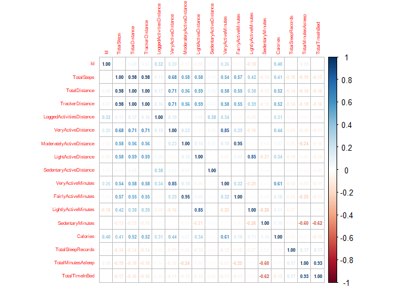<!-- -->

From the correlation plot: Positive Correlation between Calories and
Very Active Minutes , Calories and Total Distance , Calories and Total
Steps Positive correlation between Total time in bed and Total minutes
asleep Negative Correlation between sedentary minutes and total time in
bed, total minutes asleep

## Stage 5 - Share

In this stage, I will explore the relationships made from the
correlation plot and the grouped data frame

## Data Visualizations

**Fig1: Very Active Minutes Vs Calories**

``` r
ggplot(data=final_df)+
  geom_point(mapping=aes(x=VeryActiveMinutes,y=Calories)) +
  labs(title="The Relationship Between Very Active Minutes and Calories",
       x="Very Active Minutes (minutes)", y="Calories Burned (kcal)",subtitle = "Correlation: 0.61")
```

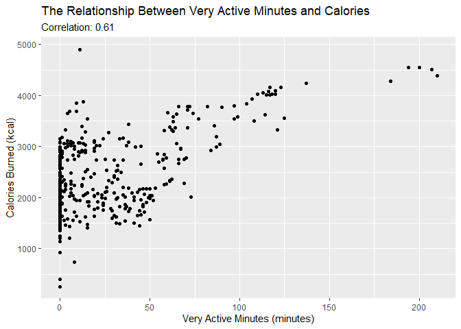<!-- -->

**Fig2: Total Distance Vs Calories**

``` r
ggplot(data=final_df)+
  geom_point(mapping=aes(x=TotalDistance,y=Calories)) +
  labs(title="The Relationship Between Total Distance and Calories",
       x="Total Distance", y="Calories Burned (kcal)",subtitle = "Correlation: 0.52")
```

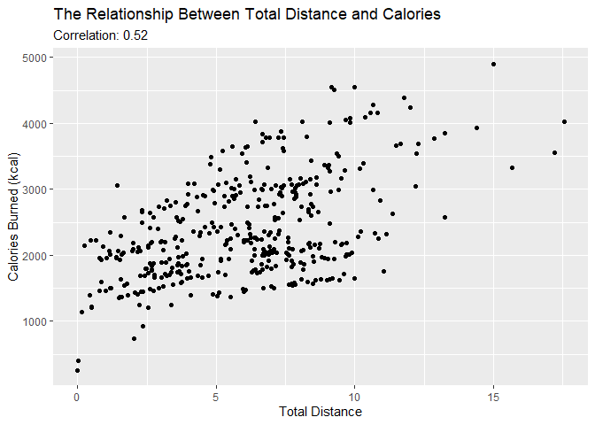<!-- -->

**Fig3: Total Steps Vs Calories**

``` r
ggplot(data=final_df)+
  geom_point(mapping=aes(x=TotalSteps,y=Calories)) +
  labs(title="The Relationship Between Total Steps and Calories",
       x="Total Steps", y="Calories Burned (kcal)",subtitle = "Correlation: 0.41")
```

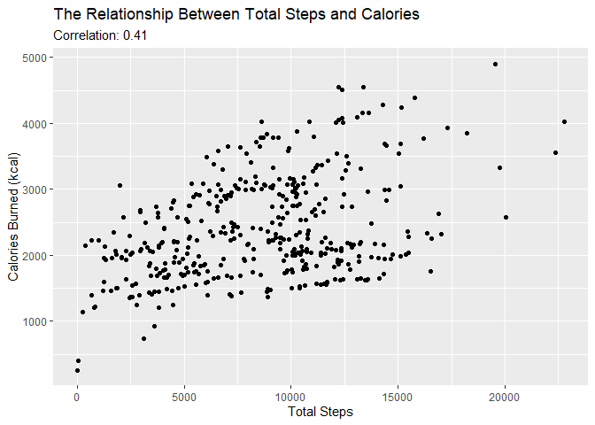<!-- -->

1.  Fig1 - Fig 3 show the positive correlation between Very Active
    Minutes & Calories , Total Distance & Calories, Total Steps &
    Calories i.e. An increase in one feature causes an increase in the
    Calories burned.
2.  The insight in (1.) is not surprising as Very Active Minutes, Total
    Distance and Total Steps have a positive correlation to one another
    as shown in the correlation plot. An increase in the Total steps
    taken will receive an increase in the Total Distance covered.

**Fig4: Total Time In Bed Vs Total Minutes Asleep **

``` r
ggplot(data=final_df)+
  geom_point(mapping=aes(x=TotalTimeInBed,y=TotalMinutesAsleep)) +
  labs(title="The Relationship Between Total Time In Bed and Total Minutes Asleep",
       x="Total Time In Bed", y="Total Minutes Asleep",subtitle = "Correlation: 0.93")
```

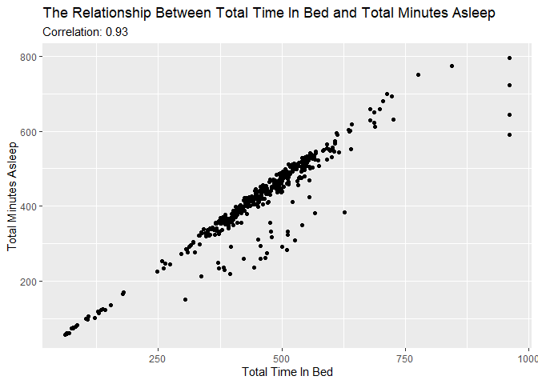<!-- -->

1.  A high positive correlation is observed between the Total Time in
    Bed and Total Minutes Asleep (0.93)

2.  The relationship is almost if not perfectly linear.

3.  An increase in the minutes asleep leads a corresponding increase in
    the total time in bed.

**Fig5: Sedentary Minutes Vs Total Minutes Asleep **

``` r
ggplot(data=final_df)+
  geom_point(mapping=aes(x=SedentaryMinutes,y=TotalMinutesAsleep)) +
  labs(title="The Relationship Between Sedentary Minutes and Total Minutes Asleep",
       x="Sedentary Minutes", y="Total Minutes Asleep",subtitle = "Correlation: -0.60")
```

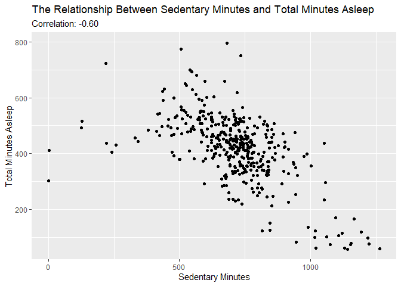<!-- -->

1.  A negative correlation is observed between sedentary minutes and
    total minutes asleep which is somewhat expected.

2.  Sedentary refers to a period a user is seating or expending very
    little energy and according to **(Madden et al., 2014)**,
    Researchers that have investigated the relationship between sleep
    and sedentary time have found that increased sedentary time is
    associated with decreased sleep efficiency in older adults,
    independent of physical activity and vice-versa.

**Fig6: Sedentary Minutes Vs Total Time In Bed **

``` r
ggplot(data=final_df)+
  geom_point(mapping=aes(x=SedentaryMinutes,y=TotalTimeInBed)) +
  labs(title="The Relationship Between Sedentary Minutes and Total Time in Bed",
       x="Sedentary Minutes", y="Total Time in Bed",subtitle = "Correlation: -0.62")
```

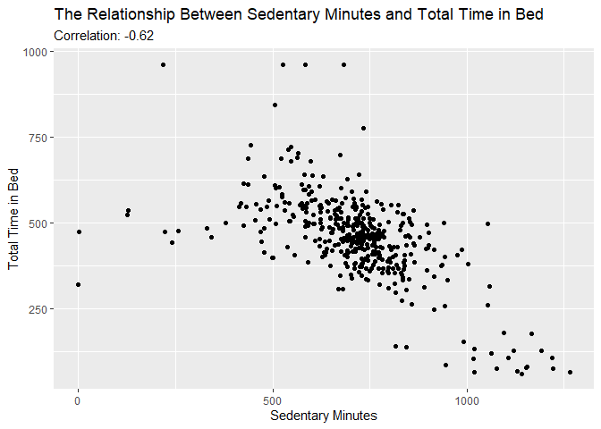<!-- -->

1.  As earlier observed, Total time in Bed and Total minutes asleep had
    a positive and almost linear correlation.

2.  It is not surprising that they both behave similarly with respect to
    Sedentary minutes.

3.  An increase in sedentary minutes leads to a decrease in the total
    time spent by a user in bed.

**Fig7: Distribution of Users based on Activity **

``` r
ggplot(data=grouped_df) +
  geom_bar(mapping=aes(x=group),width=0.5) + 
  labs(title="Distribution of users", x='User Type',y='Number of Users')
```

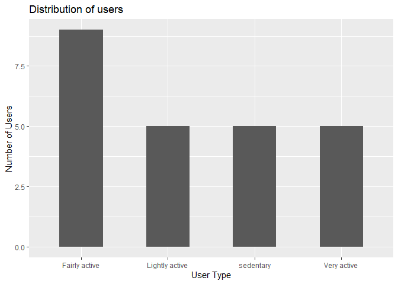<!-- -->

1.  Fairly active users are more when compared to the other categories.

2.  Lots of Users preferred to do light activities

**Fig8: Calories Burned by Groups **

``` r
ggplot(data=grouped_df) +
  geom_boxplot(mapping=aes(x=group,y=calories,fill=group))+
  labs(title="Distribution of Users based on their Groups and Calories Burned", 
       x='Groups',y='Calories Burned (kcal)')
```

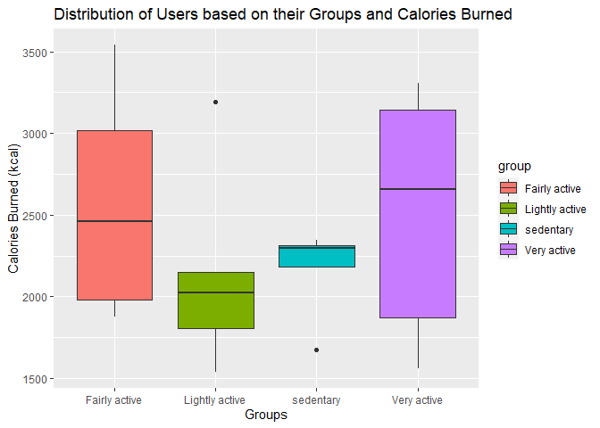<!-- -->

1.  Very Active and Fairly Active Users distribution shows they burned
    higher calories than the other categories.

2.  Sedentary Users have a short distribution and there is an outlier
    with a user who burned less than 2000 kcal.

**Fig9: Distance Covered by Categories **

``` r
library(patchwork)

p1 <- ggplot(data=grouped_df) +
  geom_violin(mapping=aes(x=group,y=distance,fill=group))+ 
labs(title="Distribution based on Distance Covered", 
       x='Groups',y='Distance')

p2 <- ggplot(data=grouped_df) +
  geom_boxplot(mapping=aes(x=group,y=distance,fill=group))+
  labs(x='Groups',y='Distance')

p1+plot_spacer()+p2+ 
  plot_layout(widths = c(2, 1))
```

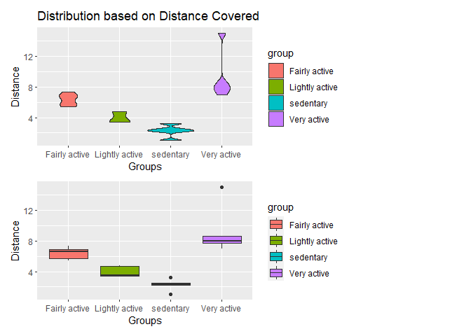<!-- -->

1.  Sedentary users covered very low distances

2.  Very active users covered very high distances when compared to the
    other users.

**Fig10: Total steps Vs Distance Covered by Categories **

``` r
ggplot(data=grouped_df)+
  geom_jitter(mapping=aes(x=distance,y=steps,color=group))+ 
labs(title="Relationship between Total Steps and Distance Covered", 
       x='Distance',y='Steps') 
```

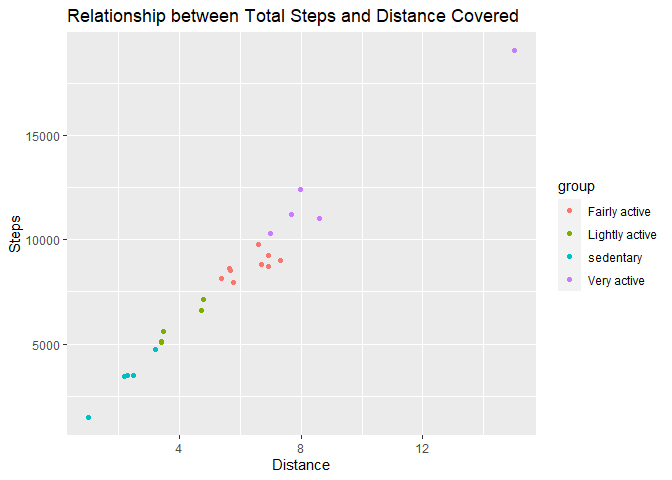<!-- -->

1.  In the order of Total Steps Vs Distance Covered: sedentary users \>
    Lightly Active users \> Fairly Active users \> Very Active users

2.  Very active users tended to cover large distances and take more
    steps

**Fig11: Distribution of Total Minutes Asleep by User Category **

``` r
ggplot(data=grouped_df)+
  geom_violin(mapping=aes(x=group,y=minutes_asleep,color=group))
```

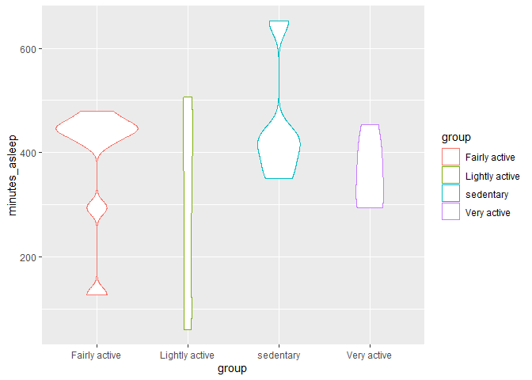<!-- -->

1.  sedentary users spent more minutes asleep than other categories.

2.  Very active users tended to sleep for 300 mins to approximately 430
    mins

## Stage 6 - Act

**Recommendations**

### Marketing Strategy

1.  **Sedentary Workers**: Bellabeat can target women whose work
    requires very little activity i.e sedentary workers. The app will
    help notify them to do light activities daily to reduce health
    related risks. The app can also create a diet plan so as to reduce
    the amount of calories they gain from food, as they burn the lowest
    calories. According to research, sedentary workers tend to have
    sleep problems so the app can contain a feature that notifies them
    when to sleep and prepare them for the next day of work to reduce
    sedentary behavior during work.

2.  **Weight Loss**: From the analysis, we can see that higher activity
    levels, increase in total steps and total distance covered per day
    tended to increase the amount of calories burned. Bellabeat can
    target women looking to reduce weight gain with app features that
    notify them on their distance covered, calories expected to burn and
    reward for keeping exercise streak.

3.  **Sleeping Habits**: Bellabeat can target consumers looking to get
    better sleeping habits so they can feel refreshed for the next day.
    The app can provide certain features like **Do not Disturb** and
    **Night mode** to prevent calls and notifications from disturbing
    the consumer’s sleep.

### Limitations

1.  The dataset cannot be said to fit the whole sample of people who use
    smart devices.

2.  The data was only collected for a period of 1 month which cannot
    account for behavioral changes.

3.  The data cannot be said to be credible as it is a copy made
    available.
